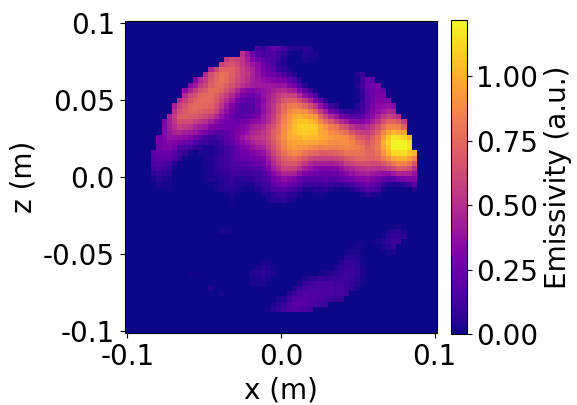

# NeurISTTOK

NeurISTTOK is essentially a Python class which allows the reconstruction of plasma emissivity profiles for the tokamak ISTTOK. Such reconstructions are performed with a transposed convolutional neural network trained with synthetic data.

<p align="center">
  
</p>

### Prerequisites

The main prerequisites for NeurISTTOK are:
```
Keras
Tensorflow
```
Other required packages include:
```
Numpy
Matplotlib
```

### Installing

To use NeurISTTOK, simply place the file "neuristtok.py" and the folder "resources" on the desired working directory.

## Getting Started

The reconstruction of the emissivity profile corresponding to an example set of ISTTOK detector measurements can be obtained with:
```
neuristtok = NeurISTTOK()

example_detectors = [0.03862430155277252, 0.01924195885658264, 0.034024521708488464,
                     0.05045965313911438, 0.09397421777248384, 0.19747403264045715, 0.42713043093681335,
                     1.1385228633880615, 1.955158352851868, 2.1131012439727783, 1.7294464111328125,
                     1.0478159189224243, 0.6096214056015015, 0.4316773414611816, 0.39510056376457214,
                     0.5283364653587341, 0.0030167747112038426, 0.0026381550645501357, 0.003103199551847207,
                     0.004558214407938495, 0.007214572676000063, 0.013286475472051322, 0.03288359095859885,
                     0.11292077744917826, 0.3959230281689734, 0.9932875096341508, 1.2231683557944835,
                     0.8695216058103546, 0.37326228790740007, 0.13186187159022722, 0.038012018010474935,
                     0.019911219256850625]
neuristtok.reconstruct_profile(real_detectors=example_detectors)
```

Furthermore, 256 sets of test detector measurements are also provided. These measurements can be plotted and reconstructed by:
```
neuristtok = NeurISTTOK()

set_number = 63
neuristtok.plot_test_detectors(test_idx=set_number)
neuristtok.reconstruct_test_detector(test_idx=set_number)
```
Finally, an .mp4 video showing the evolution of ISTTOK's plasma emissivity profile for a particular discharge and time window can be created:
```
neuristtok = NeurISTTOK()

neuristtok.profile_evolv(shot_nr=47403, init_time=168000, end_time=200000, video_name="shot47403") #300000
```

A careful description of the implemented methods and their potential can be found on [NeurISSTOK Wiki](https://github.com/RVACardoso/NeurISTTOK/wiki/NeurISTTOK-Wiki)

## Authors

* **R. V. A. Cardoso**
* **D. R. Ferreira**
* **H. Fernandes**

## License

This project is licensed under the MIT License - see the [LICENSE.md](LICENSE.md) file for details
